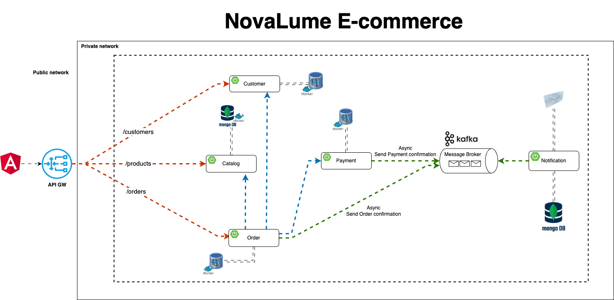
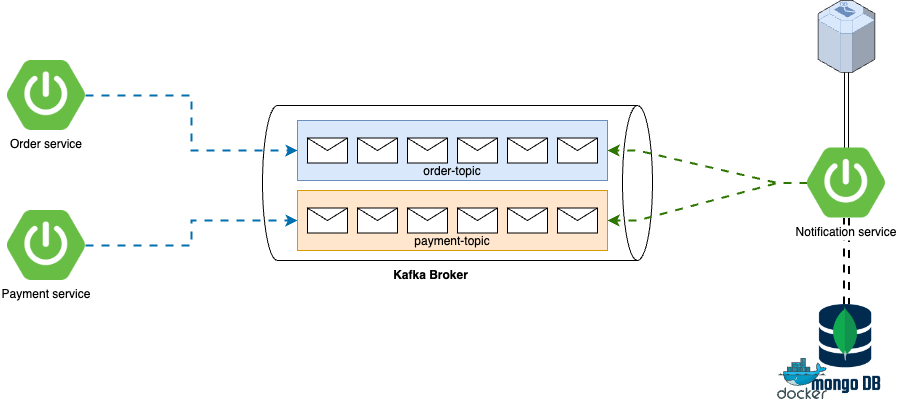

# NovaLume E-Commerce

Welcome to NovaLume, an e-commerce platform built with a microservices architecture.

## Architecture

### System Overview



### Asynchronous Communication



The NovaLume platform uses message-based asynchronous communication via Kafka/RabbitMQ for critical operations between services:

- **Order Service**: Publishes order events when orders are created, updated, or processed
- **Payment Service**: Consumes order events and publishes payment confirmation events
- **Notification Service**: Consumes events from various services to send emails and notifications

This event-driven approach ensures system resilience and scalability.

## Project Overview

NovaLume is a modern e-commerce solution with:

- Angular 19+ frontend (in progress)
- Backend microservices architecture
- GitHub Actions for CI/CD (in progress)

## Repository Structure

```plaintext
NovaLume/
├── frontend/        # Angular 19+ application (in progress)
├── backend/
│  ├── novalume-catalog-service/   # Product catalog microservice
│  ├── novalume-order-service/     # Order management (planned)
│  └── novalume-auth-service/      # Authentication (planned)
└── docs/
   └── architecture/              # Architecture documentation
      ├── images/                 # Diagrams and visual documentation
      └── novalume-architecture.drawio  # Source file for architecture diagram
```

## Available Services

### [Catalog Service](./backend/novalume-catalog-service)

Manages product listings, categories, and inventory.

### Order Service

Order processing and management (in development).

### Authentication Service

User management and authentication (in development).

## Development

This project is under active development. More services and features will be added over time.

## CI/CD

CI/CD pipelines with GitHub Actions are being set up to automate testing, building, and deployment processes.

## License

[MIT License](LICENSE)
